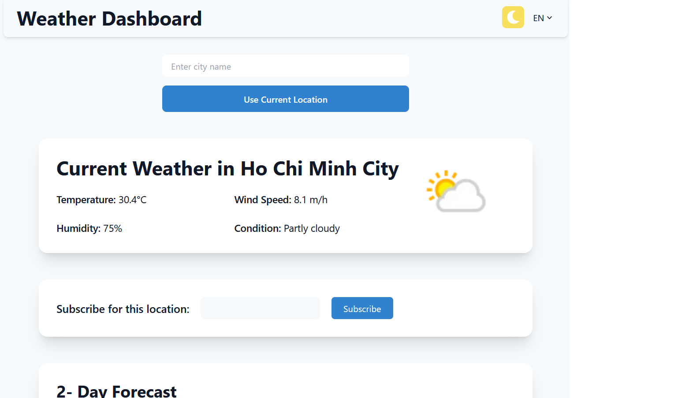
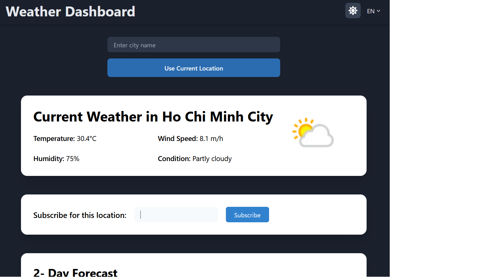
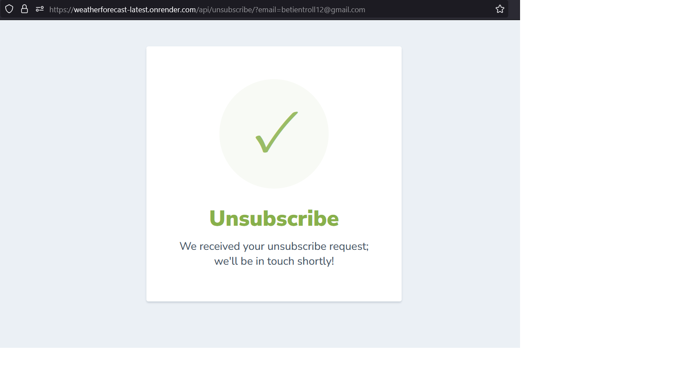
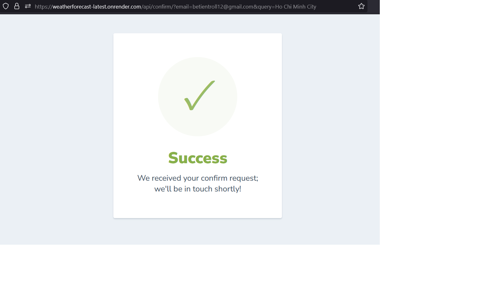
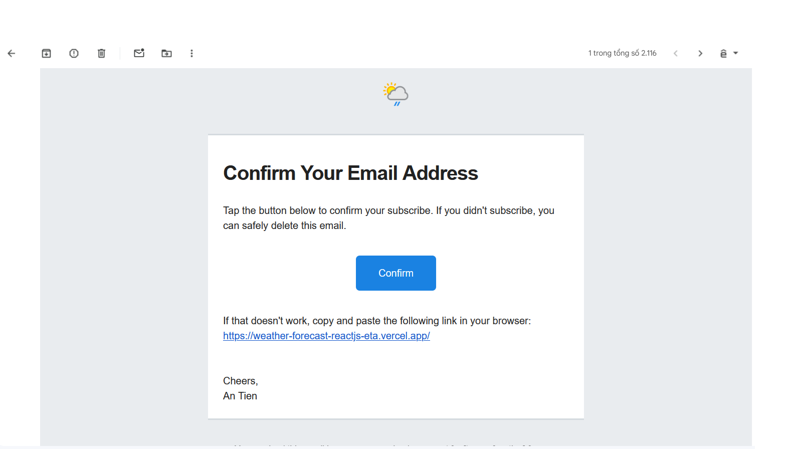
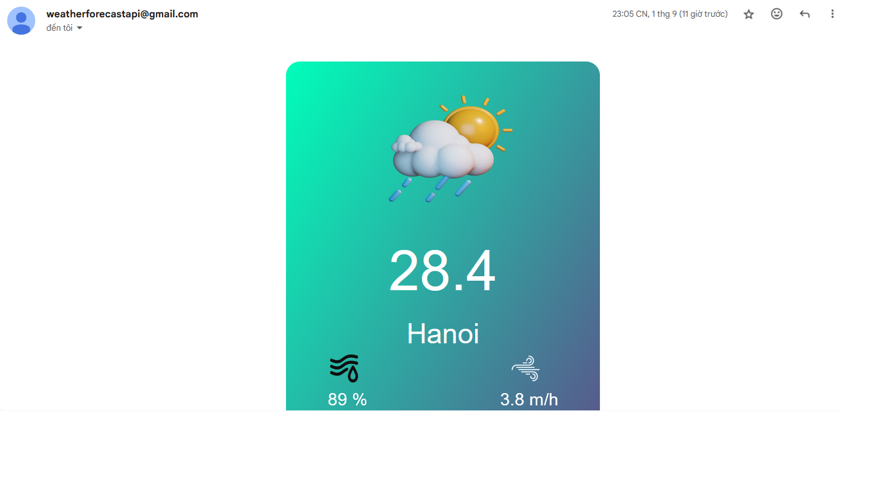

# Weather Forecast

 The weather forecast app supports multiple languages, providing users with localized weather information in their preferred language.


## Table of contents
* ✨[Features](#features)
* 🛠️[Prerequisites](#prerequisites)
* 🚀[Getting Started](#getting-started)
* 🏠[User Interface](#user-interface)
* 📧[Contact](#contact)

## ✨Features
#### 1. Data Caching
- **Cache data**: Redis database will save weather forecast in cache within 5 minutes so that users can get data faster for next time.
#### 2. Cron Job 
- **Dayly forecast in email**: User can subscribe to get weather forecast dayly in free.
#### 3. Confirm subscribe
- **Smtp email systems**: When subscribe users must confirm it by email to get weather forecast everyday.
- **Unsubscribe**: Users can unsubscribe if they don't need it anymore.
#### 4. Get weather forecast client:
- **Multilingual**: The system supports many languages ​​for users.
- **User Interface**: User-friendly interface allows users to access on any device.

## 🛠️Prerequisites
What you need to run the project:
- [Docker](https://www.docker.com/) - Streamline your local setup by using Docker to containerize and run the project without needing additional dependencies.
- [Python](https://www.python.org/) - Streamline your local setup by using Python tyo create server with virtual environment python

## 🏠User Interface
</img>
</img>
</img>
</img>
</img>
</img>

## 🚀Getting Started
```shell
# download the project
git clone https://github.com/antiennn/Weather-Forecast-Django/
# Create and activate a virtual environment using
python -m venv .venv
source .venv\Scripts\activate
# Install lib
pip install -R requirements.txt
# Run server
python manage.py runserver
```
At this time, you can now access the administration portal by navigating to http://localhost:8000/. Alternatively, user can access to the resident site at http://localhost:3000/.

## 📧Contact
Don't hesitate to contact me if you have any confusion or questions
<a href="mailto://tranantien12@gmail.com" target="blank">
  
</a>
<a href="http://www.linkedin.com/in/antienn/" target="blank">
  
</a>

<a href="#apartment-management" style="transition: all .25s ease-in-out; position: fixed; bottom: 0; right: 0; display: inline-flex; cursor: pointer; align-items: center; justify-content: center; margin: 0 2em 2em 0; padding: .25em; width: 8em; height: 2em;">
  🔼 Back to top
</a>
